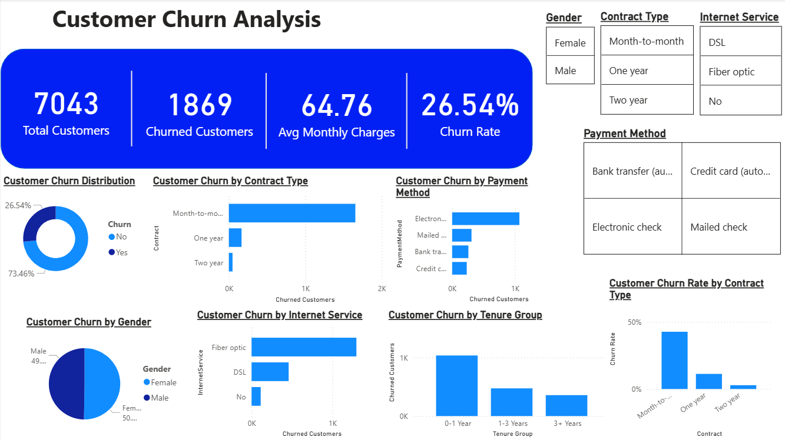

## 📊 Customer Churn Analysis
---
⭐ End-to-End Data Analysis Project
Tools Used: Python | SQL | Power BI
Focus: Business Insights & Decision Making
---
## Overview

This project analyzes customer churn in a telecom dataset to identify key factors influencing customer attrition.
The goal is to help businesses reduce churn and improve customer retention using data-driven insights.

---
---
 ## 🎯 Problem Statement
---
Customer churn is a major challenge for telecom companies.
This project aims to:

 - Identify customers likely to churn
 - Understand factors driving churn
 - Provide actionable strategies to improve retention
---
## Dashboard Preview



---

## Dataset

The dataset contains telecom customer information with **7043 records** and several attributes related to services and customer behavior.

Key columns include:

* Gender
* Tenure
* Contract Type
* Internet Service
* Payment Method
* Monthly Charges
* Churn Status

---

## Key Metrics

* **Total Customers:** 7043
* **Churned Customers:** 1869
* **Average Monthly Charges:** 64.76
* **Churn Rate:** 26.54%

---

## Key Insights

* Customers with **month-to-month contracts have the highest churn rate**.
* **Fiber optic internet users churn more frequently than DSL users**.
* Customers using **electronic check payment method show higher churn**.
* Customers with **tenure < 1 year are more likely to churn**.

---
 ## 🚀 Actionable Insights
 ---
- High-risk customers contribute significantly to overall churn
- Short-term contract users are more likely to leave
- High monthly charges increase churn probability 

  ---
  
  
  ## 💡 Business Recommendations
  ---
  
- Offer discounts or incentives for long-term contracts
- Target high-risk customers with retention campaigns
- Improve service quality for fiber optic users
- Provide better pricing strategies for high-charge customers

  ---
  
 ## 🧠 Why This Project Matters

This project demonstrates a real-world data analysis workflow:

- Data cleaning
- SQL querying
- Data visualization
- Insight generation
- Business decision-making
  
## Tools & Technologies

* **Python** – Data cleaning and exploratory analysis
* **SQL** – Querying and data analysis
* **Power BI** – Interactive dashboard and visualization

---

## Project Structure

```
customer-churn-analysis
│
├── dataset       # raw dataset
├── python        # data analysis scripts
├── sql           # SQL queries
├── powerbi       # Power BI dashboard (.pbix)
├── churn_dashboard.png # dashboard preview
└── README.md
```

---

## Author

**Bhavya Sree**

